# 📄 Dokumentasi Diagram Sistem Manajemen Indekos Ungu

## Use Case Diagram

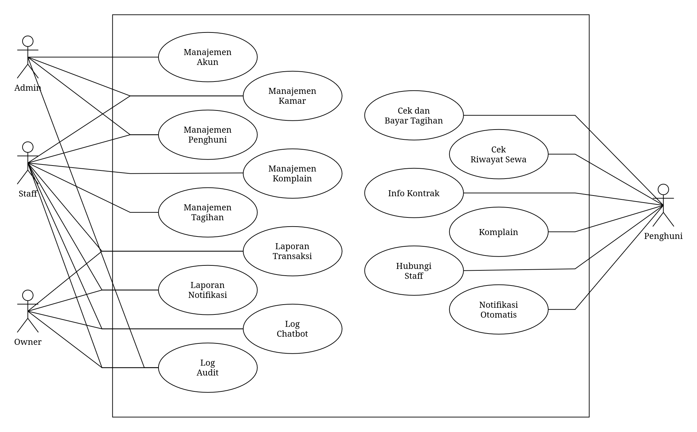

_Use case diagram_ pada sistem ini menggambarkan interaksi antara aktor eksternal dengan sistem manajemen indekos. Diagram ini menunjukkan bagaimana setiap aktor memanfaatkan fitur sistem sesuai dengan peran dan kebutuhan masing-masing. Aktor yang terlibat dalam sistem terdiri dari empat peran utama, yaitu:

- **Admin** — Bertanggung jawab terhadap pengelolaan akun pengguna dalam sistem.
- **_Staff_** — Menangani operasional harian seperti manajemen kamar, penghuni, tagihan, dan komplain.
- **_Owner_** — Memiliki hak akses baca (_read-only_) untuk memantau hasil kerja _staff_ melalui laporan transaksi, _log_ _audit_, _log_ _chatbot_, laporan notifikasi, manajemen komplain, dan manajemen tagihan.
- **Penghuni** — Berinteraksi dengan sistem melalui perantara _chatbot_ untuk mengakses layanan seperti cek dan bayar tagihan, cek riwayat sewa, info kontrak, komplain, hubungi _staff_, serta menerima notifikasi otomatis.

## Activity Diagram

_Activity diagram_ berikut menggambarkan alur kerja dari sisi pengguna (aktor) saat berinteraksi dengan sistem. Setiap diagram menjelaskan langkah-langkah yang diambil oleh aktor beserta respons sistem secara berurutan.

### 1. Manajemen Akun

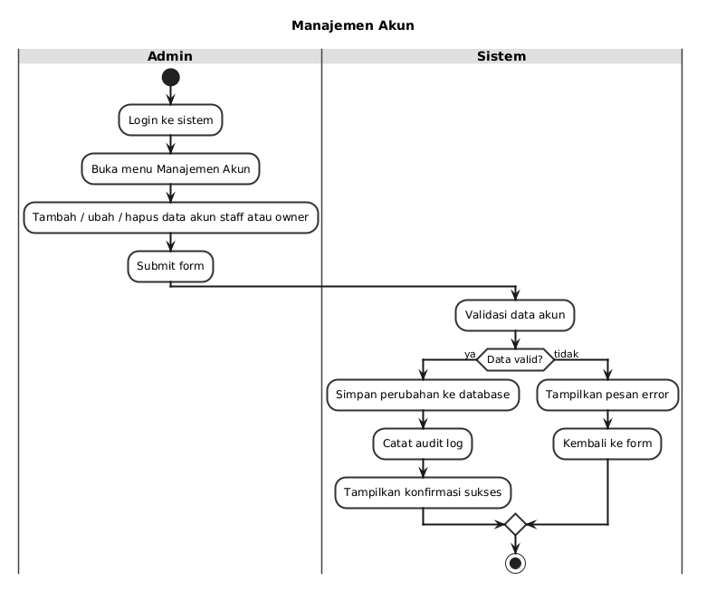

Admin membuka menu kelola akun, lalu memilih untuk menambah, mengubah, atau menghapus data akun _staff_ atau _owner_. Sistem memvalidasi data yang dimasukkan, menyimpan perubahan ke _database_, mencatat _audit_ _log_, dan menampilkan konfirmasi berhasil atau pesan _error_ jika data tidak valid.

### 2. Manajemen Kamar

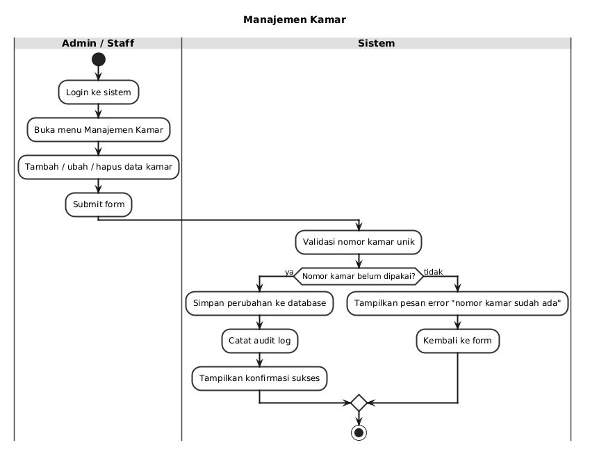

_Staff_ membuka menu kelola kamar, lalu memilih aksi tambah, ubah, atau hapus kamar. Sistem memvalidasi nomor kamar unik, menyimpan perubahan, mencatat _audit_ _log_, dan menampilkan konfirmasi hasil.

### 3. Manajemen Penghuni

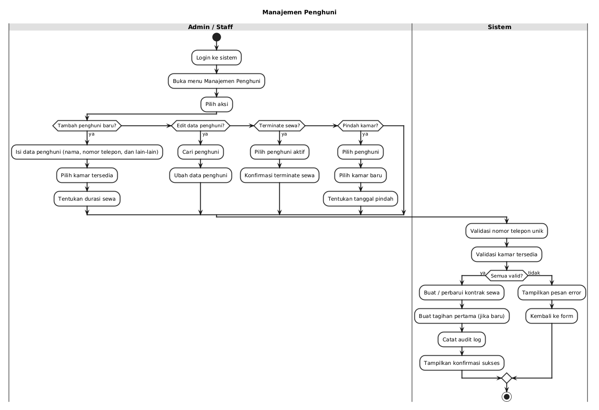

_Staff_ dapat menambah, mengedit, atau mengakhiri sewa penghuni. Untuk penghuni baru, _staff_ mengisi data diri, memilih kamar, dan menentukan durasi sewa. Sistem memvalidasi nomor telepon unik dan ketersediaan kamar, lalu membuat kontrak sewa dan tagihan pertama.

### 4. Manajemen Komplain (_Staff_)

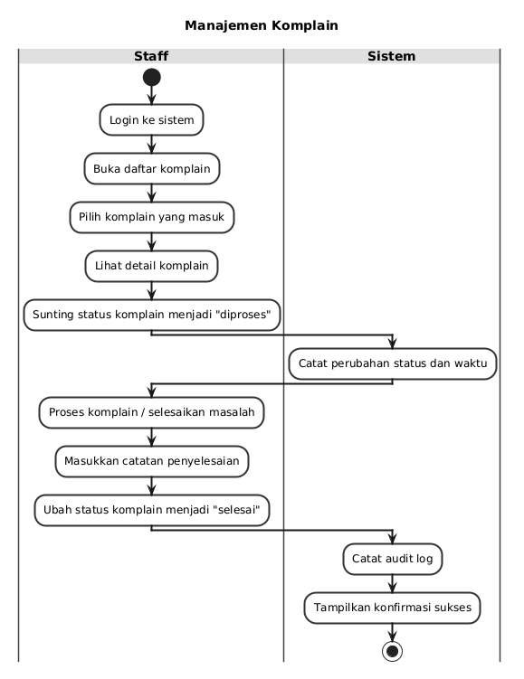

_Staff_ membuka daftar komplain dari penghuni, melihat _detail_-nya, lalu memproses atau menyelesaikannya. Sistem mencatat setiap perubahan _status_ dan _audit_ _log_.

### 5. Manajemen Tagihan

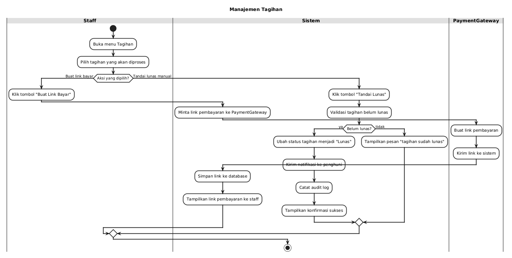

_Staff_ memilih tagihan yang akan diproses. Jika memilih buat _link_ bayar, sistem meminta _link_ pembayaran dari _payment_ _gateway_ dan menampilkannya ke _staff_. Jika memilih tandai lunas manual, sistem memvalidasi _status_ tagihan, mengubahnya menjadi lunas, dan mengirim notifikasi ke penghuni.

### 6. Laporan Transaksi

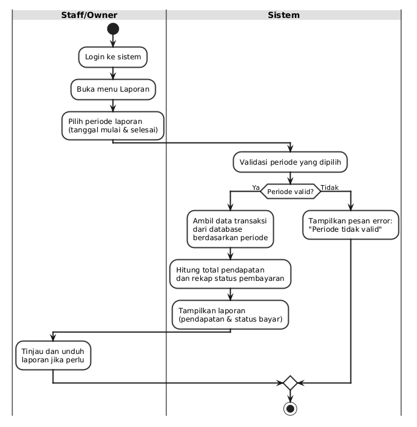

_Staff_ atau _owner_ memilih _periode_ laporan. Sistem mengambil data transaksi berdasarkan _periode_, menghitung total pendapatan dan rekap _status_ pembayaran, lalu menampilkan laporan yang dapat ditinjau atau diunduh.

### 7. Laporan Notifikasi

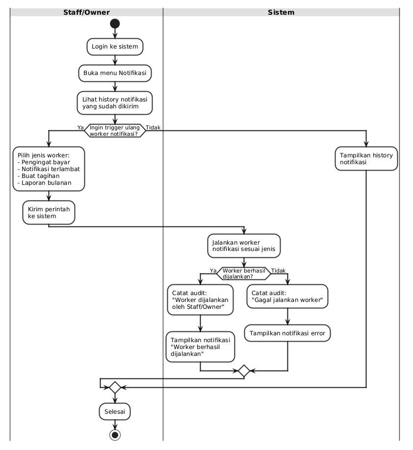

_Staff_ atau _owner_ melihat riwayat notifikasi yang sudah dikirim. Jika ingin memicu ulang _worker_ notifikasi, _staff_ memilih jenisnya (pengingat bayar, notifikasi terlambat, buat tagihan, atau laporan bulanan) dan sistem menjalankannya.

### 8. Log Chatbot

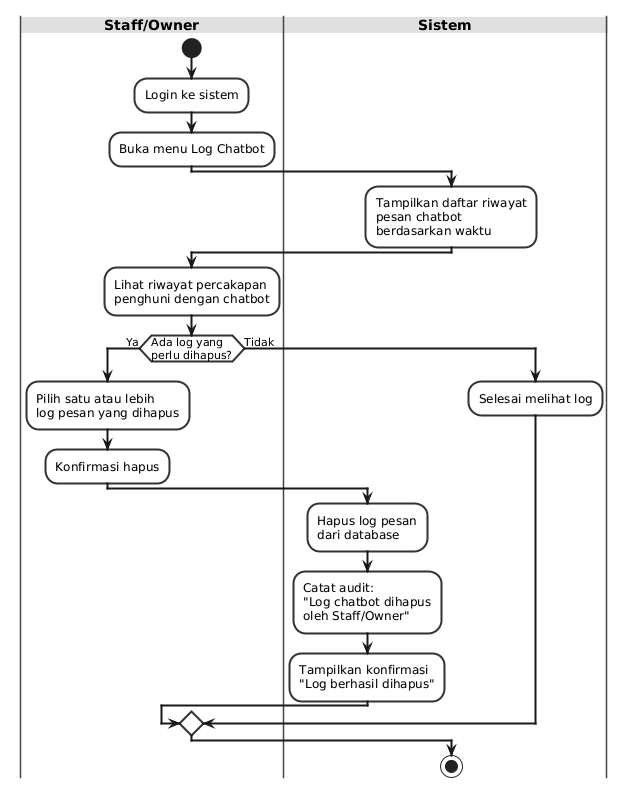

_Staff_ atau _owner_ melihat riwayat percakapan penghuni dengan _chatbot_. Jika ada _log_ yang perlu dihapus, _staff_ dapat memilih dan menghapusnya, dan sistem mencatat _audit_ _log_ penghapusan.

### 9. Log Audit

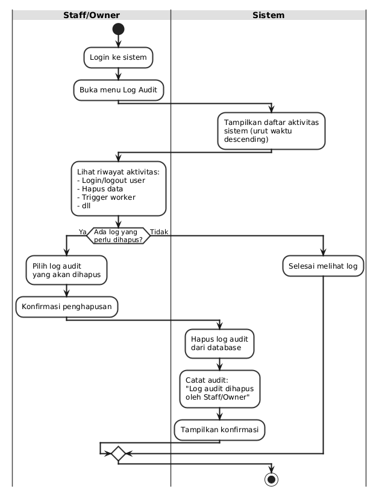

_Staff_ atau _owner_ melihat daftar aktivitas sistem seperti _login_, _logout_, hapus data, atau _trigger_ _worker_. Jika perlu, _log_ _audit_ tertentu dapat dihapus dan sistem mencatat penghapusan tersebut sebagai _audit_ baru.

### 10. Cek dan Bayar Tagihan

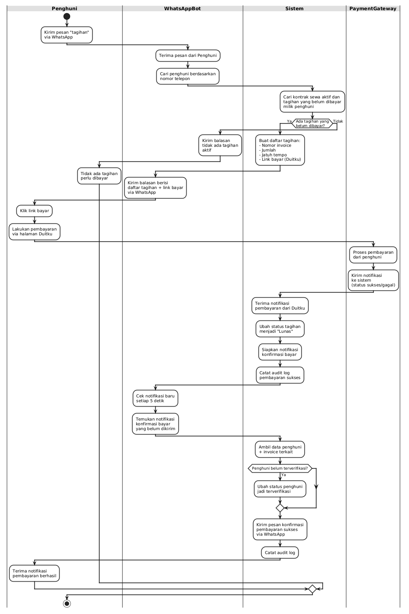

Penghuni mengirim perintah "tagihan" _via_ _WhatsApp_. _WhatsApp Bot_ meneruskan ke sistem, yang mencari kontrak aktif dan tagihan yang belum dibayar. Sistem mengembalikan daftar tagihan beserta _link_ pembayaran. Penghuni _klik_ _link_, melakukan pembayaran melalui _payment_ _gateway_, dan sistem menerima notifikasi hasil pembayaran serta mengubah _status_ tagihan menjadi lunas.

### 11. Cek Riwayat Sewa

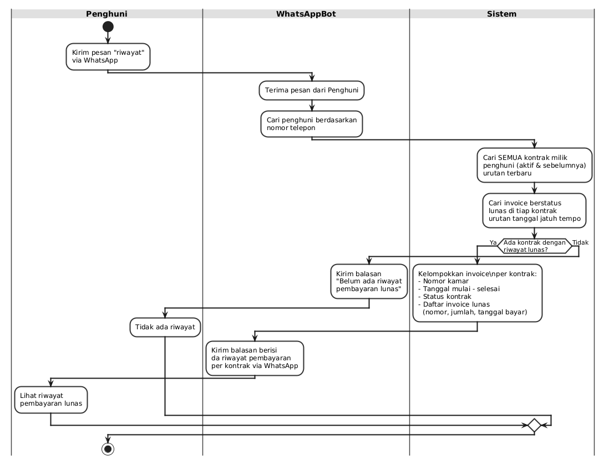

Penghuni mengirim perintah "riwayat" _via_ _WhatsApp_. _WhatsApp Bot_ meneruskan ke sistem, yang mencari semua kontrak milik penghuni beserta _invoice_ yang sudah lunas. Sistem mengembalikan riwayat pembayaran per kontrak yang ditampilkan ke penghuni.

### 12. Info Kontrak

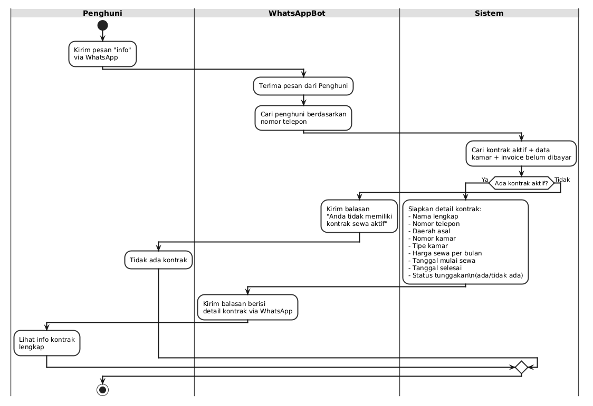

Penghuni mengirim perintah "info" _via_ _WhatsApp_. _WhatsApp Bot_ meneruskan ke sistem, yang mencari kontrak aktif dan data kamar penghuni. Sistem mengembalikan _detail_ kontrak seperti nomor kamar, harga, tanggal mulai dan selesai sewa, yang ditampilkan ke penghuni.

### 13. Komplain (Penghuni)

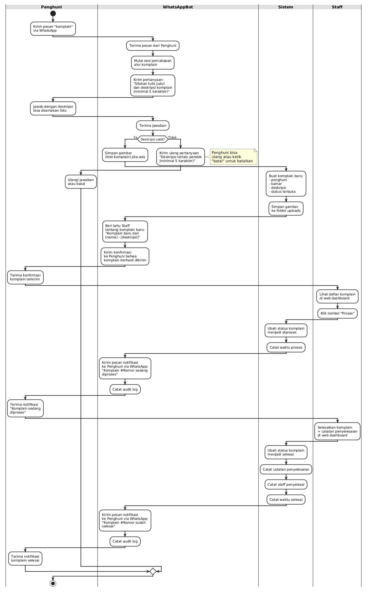

Penghuni mengirim perintah "komplain" _via_ _WhatsApp_. _WhatsApp Bot_ memandu penghuni untuk memasukkan judul dan deskripsi komplain, termasuk foto jika diperlukan. Komplain disimpan ke sistem, lalu _staff_ melihat dan memprosesnya melalui _dashboard_ _web_. Penghuni mendapat notifikasi saat komplain diproses dan selesai.

### 14. Hubungi _Staff_

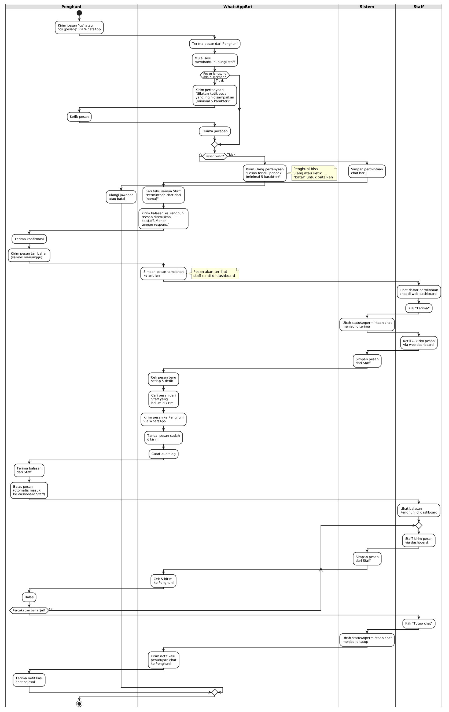

Penghuni mengirim perintah "cs" _via_ _WhatsApp_. _WhatsApp Bot_ memulai _sesi_ _chat_, menyimpan pesan penghuni, dan memberitahu _staff_ melalui _dashboard_ _web_. _Staff_ menerima _chat_, membalas pesan, dan melanjutkan percakapan. Setelah selesai, _staff_ menutup _chat_ dan penghuni mendapat notifikasi penutupan.

### 15. Notifikasi Otomatis

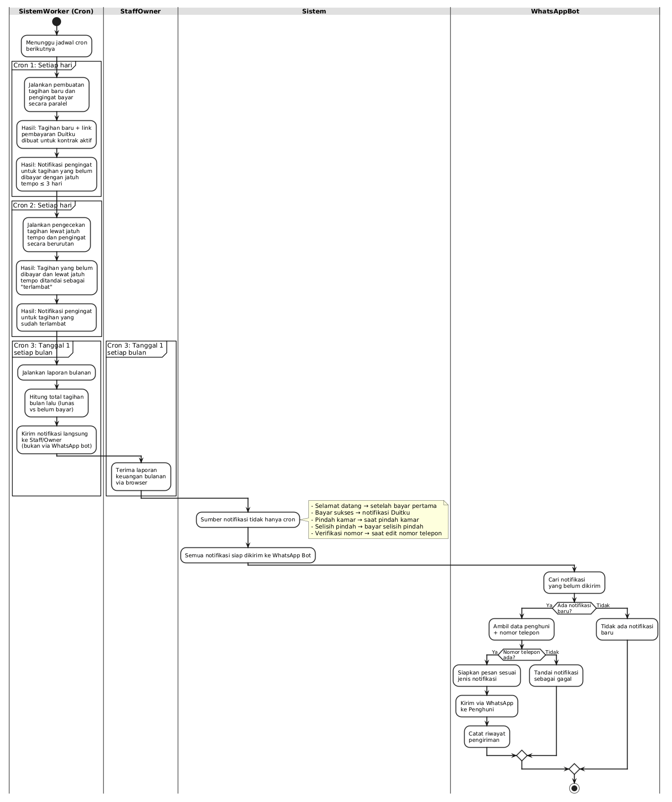

Sistem menjalankan _worker_ _cron_ setiap hari untuk membuat tagihan baru, mengirim pengingat bayar untuk tagihan yang jatuh tempo dalam 3 hari, serta menandai tagihan terlambat. Tanggal 1 setiap bulan, sistem mengirim laporan bulanan ke _staff_ dan _owner_. Notifikasi lain seperti selamat datang setelah bayar pertama, konfirmasi bayar sukses, pemberitahuan pindah kamar, dan verifikasi nomor telepon juga dikirim melalui _WhatsApp_ _Bot_ ke penghuni.

## Sequence Diagram

_Sequence diagram_ berikut menggambarkan urutan interaksi antara aktor dan komponen sistem dalam setiap _skenario_ _use_ _case_. Setiap diagram menunjukkan alur pesan secara kronologis.

### 1. Manajemen Akun

Admin membuka menu kelola akun, sistem menampilkan daftar akun. Admin memilih tambah, ubah, atau hapus akun, sistem memvalidasi data, menyimpan perubahan, mencatat _audit_ _log_, dan mengembalikan konfirmasi berhasil.

### 2. Manajemen Kamar

_Staff_ membuka menu kelola kamar, sistem menampilkan daftar kamar. _Staff_ memilih tambah, ubah, atau hapus kamar, sistem memvalidasi nomor kamar unik, menyimpan perubahan, mencatat _audit_ _log_, dan mengembalikan konfirmasi.

### 3. Manajemen Penghuni

_Staff_ membuka menu penghuni, sistem menampilkan daftar penghuni. _Staff_ memilih tambah penghuni dan mengisi data diri. Sistem memvalidasi nomor telepon unik dan ketersediaan kamar, lalu membuat data penghuni, kontrak sewa aktif, dan tagihan pertama.

### 4. Manajemen Komplain (_Staff_)

_Staff_ membuka daftar komplain, sistem menampilkan komplain yang masih terbuka. _Staff_ melihat _detail_, mengklik proses, sistem mengubah _status_ menjadi diproses. _Staff_ menyelesaikan komplain dengan catatan, sistem mengubah _status_ menjadi selesai dan mencatat _audit_.

### 5. Manajemen Tagihan

_Staff_ membuka daftar tagihan. Untuk buat _link_ bayar, _staff_ memilih tagihan, sistem meminta _link_ ke _payment_ _gateway_ dan menyimpannya. Untuk tandai lunas, _staff_ memilih tagihan, sistem memvalidasi, mengubah _status_ menjadi lunas, mengirim notifikasi ke penghuni, dan mencatat _audit_.

### 6. Laporan Transaksi

_Staff_ atau _owner_ membuka menu laporan dan memilih _periode_. Sistem mengambil data transaksi dan menampilkan laporan pendapatan beserta _status_ pembayaran.

### 7. Laporan Notifikasi

_Staff_ atau _owner_ membuka menu notifikasi, sistem menampilkan riwayat notifikasi dan opsi _trigger_ ulang. _Staff_ memilih jenis _worker_ untuk dijalankan, sistem menjalankannya dan mencatat _audit_.

### 8. Log Chatbot

_Staff_ atau _owner_ membuka _log_ _chatbot_, sistem menampilkan riwayat pesan penghuni. _Staff_ dapat mem-_filter_ atau menghapus _log_, sistem mencatat _audit_ _log_ penghapusan.

### 9. Log Audit

_Staff_ atau _owner_ membuka _log_ _audit_, sistem menampilkan daftar aktivitas. _Staff_ dapat mem-_filter_ atau menghapus _log_, sistem mencatat _audit_ untuk penghapusan tersebut.

### 10. Cek dan Bayar Tagihan

Penghuni mengirim "tagihan" _via_ _WhatsApp_. _WhatsApp Bot_ meneruskan ke sistem, yang mencari kontrak aktif dan tagihan belum bayar. Sistem mengembalikan daftar tagihan dan _link_ bayar. Penghuni membayar melalui _payment_ _gateway_, yang mengirim notifikasi ke sistem. Sistem mengubah _status_ tagihan menjadi lunas dan menyiapkan konfirmasi. _WhatsApp Bot_ mengirim konfirmasi bayar ke penghuni.

### 11. Cek Riwayat Sewa

Penghuni mengirim "riwayat" _via_ _WhatsApp_. _WhatsApp Bot_ meneruskan ke sistem, yang mencari semua kontrak dan tagihan lunas. Sistem mengembalikan riwayat pembayaran per kontrak yang ditampilkan ke penghuni.

### 12. Info Kontrak

Penghuni mengirim "info" _via_ _WhatsApp_. _WhatsApp Bot_ meneruskan ke sistem, yang mencari kontrak aktif dan data kamar. Sistem mengembalikan _detail_ kontrak seperti nomor kamar, harga, dan tanggal sewa.

### 13. Komplain (Penghuni)

Penghuni mengirim "komplain" _via_ _WhatsApp_. _WhatsApp Bot_ memandu penghuni mengisi judul dan deskripsi. Komplain disimpan ke sistem. _Staff_ melihat dan memproses komplain di _dashboard_. _WhatsApp Bot_ mengirim notifikasi ke penghuni saat komplain diproses dan saat selesai.

### 14. Hubungi _Staff_

Penghuni mengirim "cs" _via_ _WhatsApp_. _WhatsApp Bot_ memulai _sesi_ _chat_ dan menyimpan pesan. _Staff_ melihat permintaan _chat_ di _dashboard_ dan menerimanya. _Staff_ membalas pesan melalui _web_, _WhatsApp Bot_ mengirim balasan ke penghuni. Penghuni membalas, dan percakapan berlanjut hingga _staff_ menutup _chat_ dan sistem mencatat penutupan.

### 15. Notifikasi Otomatis

Sistem (_worker_ _cron_) mencari tagihan yang belum dibayar dan menyiapkan pengingat untuk tagihan yang jatuh tempo dalam 3 hari. _WhatsApp Bot_ mengirim pengingat ke penghuni. Sistem juga mengecek tagihan lewat jatuh tempo dan menandainya sebagai terlambat. _WhatsApp Bot_ mengirim pengingat keterlambatan ke penghuni. Untuk pembayaran sukses, _payment_ _gateway_ memberi tahu sistem, yang mengubah _status_ dan memverifikasi penghuni jika bayar pertama. _WhatsApp Bot_ mengirim konfirmasi bayar sukses ke penghuni.
