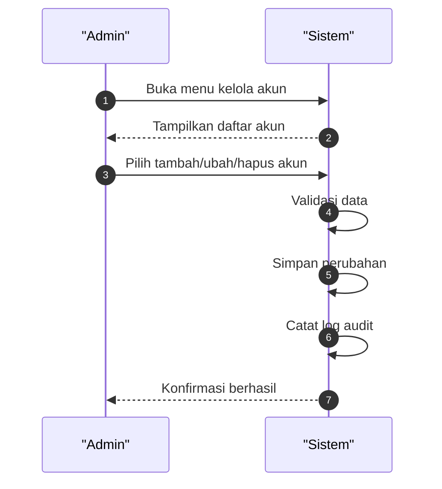

# 01 — Manajemen Akun

```mermaid
sequenceDiagram
    autonumber
    participant Admin as "Admin"
    participant Sistem as "Sistem"

    Admin->>Sistem: Buka menu kelola akun
    Sistem-->>Admin: Tampilkan daftar akun
    Admin->>Sistem: Pilih tambah/ubah/hapus akun
    Sistem->>Sistem: Validasi data
    Sistem->>Sistem: Simpan perubahan
    Sistem->>Sistem: Catat log audit
    Sistem-->>Admin: Konfirmasi berhasil
```
