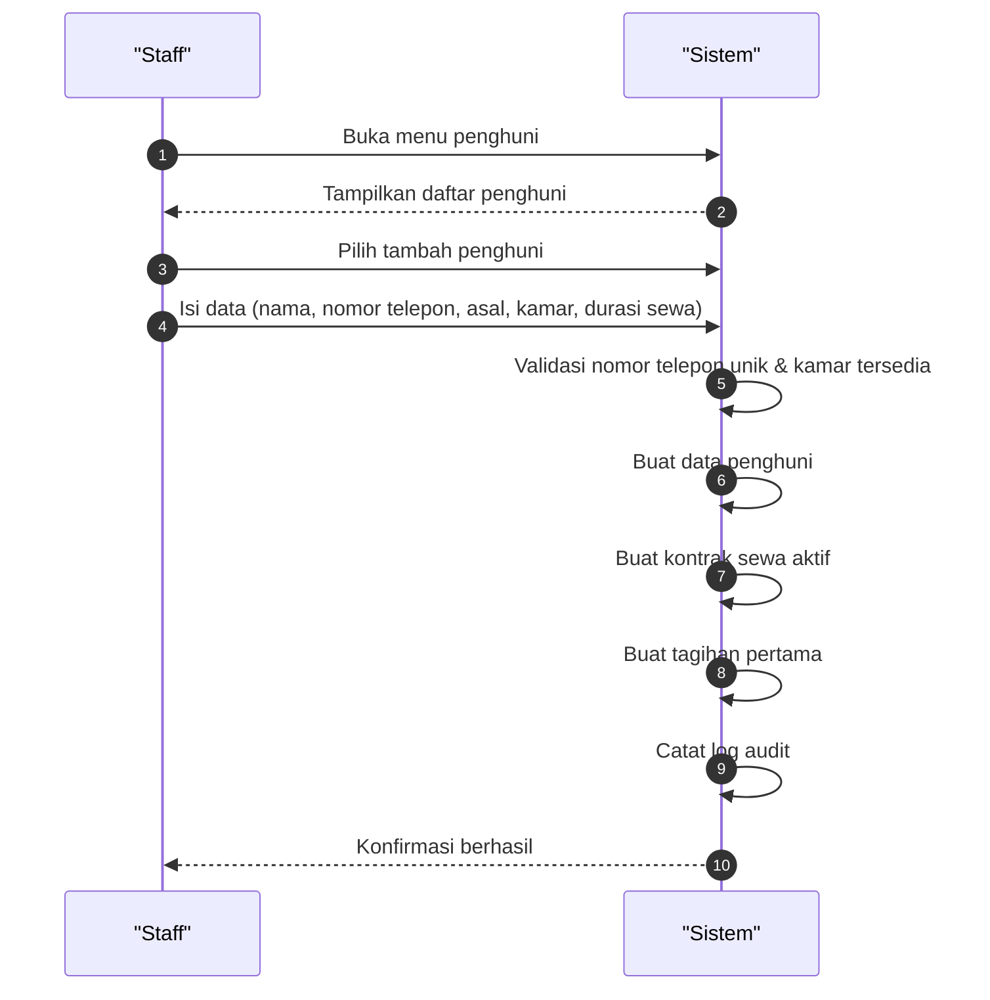

# 03 — Manajemen Penghuni

```mermaid
sequenceDiagram
    autonumber
    participant Staff as "Staff"
    participant Sistem as "Sistem"

    Staff->>Sistem: Buka menu penghuni
    Sistem-->>Staff: Tampilkan daftar penghuni
    Staff->>Sistem: Pilih tambah penghuni
    Staff->>Sistem: Isi data (nama, nomor telepon, asal, kamar, durasi sewa)
    Sistem->>Sistem: Validasi nomor telepon unik & kamar tersedia
    Sistem->>Sistem: Buat data penghuni
    Sistem->>Sistem: Buat kontrak sewa aktif
    Sistem->>Sistem: Buat tagihan pertama
    Sistem->>Sistem: Catat log audit
    Sistem-->>Staff: Konfirmasi berhasil
```
