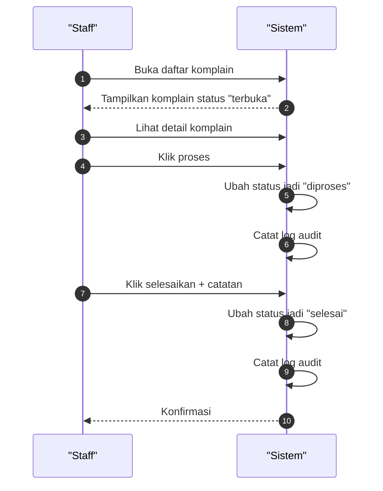

# 04 — Manajemen Komplain

```mermaid
sequenceDiagram
    autonumber
    participant Staff as "Staff"
    participant Sistem as "Sistem"

    Staff->>Sistem: Buka daftar komplain
    Sistem-->>Staff: Tampilkan komplain status "terbuka"
    Staff->>Sistem: Lihat detail komplain
    Staff->>Sistem: Klik proses
    Sistem->>Sistem: Ubah status jadi "diproses"
    Sistem->>Sistem: Catat log audit
    Staff->>Sistem: Klik selesaikan + catatan
    Sistem->>Sistem: Ubah status jadi "selesai"
    Sistem->>Sistem: Catat log audit
    Sistem-->>Staff: Konfirmasi
```
