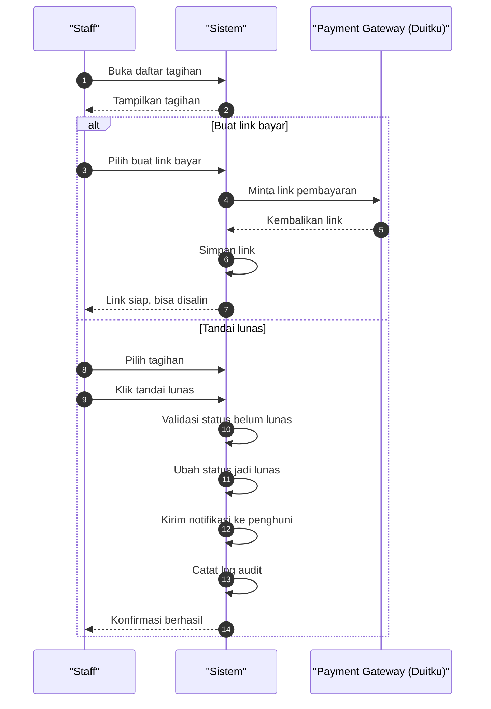

# 05 — Manajemen Tagihan

```mermaid
sequenceDiagram
    autonumber
    participant Staff as "Staff"
    participant Sistem as "Sistem"
    participant PaymentGateway as "Payment Gateway (Duitku)"

    Staff->>Sistem: Buka daftar tagihan
    Sistem-->>Staff: Tampilkan tagihan

    alt Buat link bayar
        Staff->>Sistem: Pilih buat link bayar
        Sistem->>PaymentGateway: Minta link pembayaran
        PaymentGateway-->>Sistem: Kembalikan link
        Sistem->>Sistem: Simpan link
        Sistem-->>Staff: Link siap, bisa disalin

    else Tandai lunas
        Staff->>Sistem: Pilih tagihan
        Staff->>Sistem: Klik tandai lunas
        Sistem->>Sistem: Validasi status belum lunas
        Sistem->>Sistem: Ubah status jadi lunas
        Sistem->>Sistem: Kirim notifikasi ke penghuni
        Sistem->>Sistem: Catat log audit
        Sistem-->>Staff: Konfirmasi berhasil
    end
```
