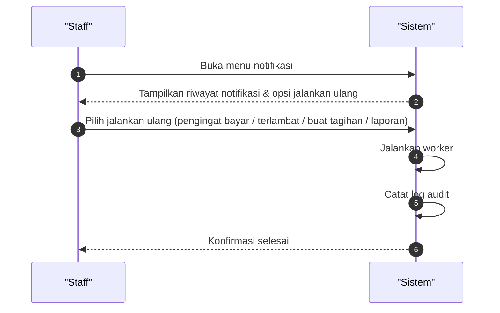

# 07 — Laporan Notifikasi

```mermaid
sequenceDiagram
    autonumber
    participant Staff as "Staff"
    participant Sistem as "Sistem"

    Staff->>Sistem: Buka menu notifikasi
    Sistem-->>Staff: Tampilkan riwayat notifikasi & opsi jalankan ulang
    Staff->>Sistem: Pilih jalankan ulang (pengingat bayar / terlambat / buat tagihan / laporan)
    Sistem->>Sistem: Jalankan worker
    Sistem->>Sistem: Catat log audit
    Sistem-->>Staff: Konfirmasi selesai
```
