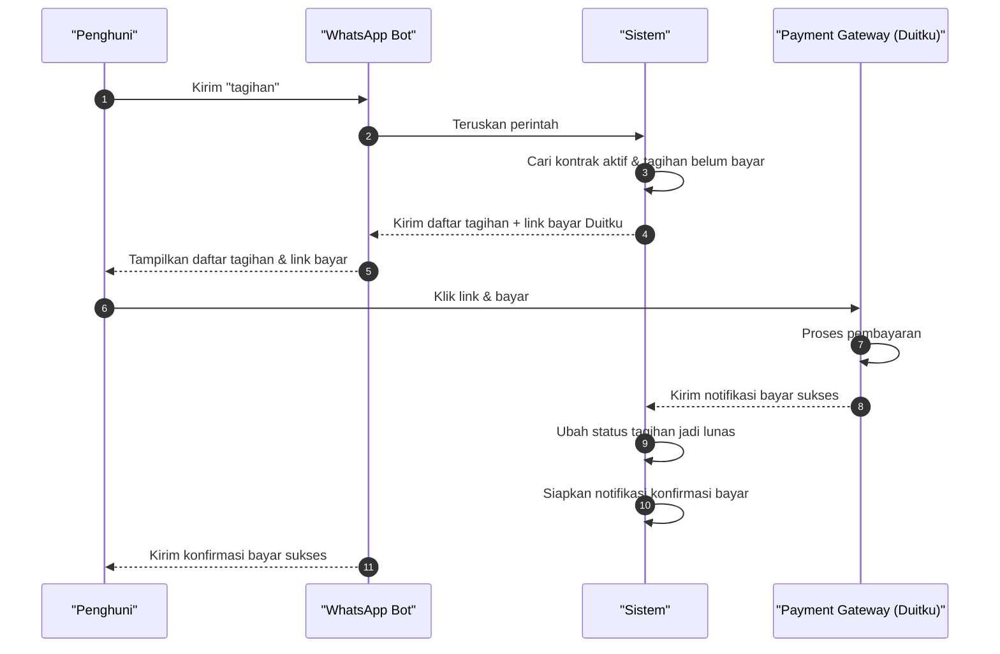

# Cek dan Bayar Tagihan

```mermaid
sequenceDiagram
    autonumber
    participant Penghuni as "Penghuni"
    participant WhatsAppBot as "WhatsApp Bot"
    participant Sistem as "Sistem"
    participant PaymentGateway as "Payment Gateway (Duitku)"

    Penghuni->>WhatsAppBot: Kirim "tagihan"
    WhatsAppBot->>Sistem: Teruskan perintah
    Sistem->>Sistem: Cari kontrak aktif & tagihan belum bayar
    Sistem-->>WhatsAppBot: Kirim daftar tagihan + link bayar Duitku
    WhatsAppBot-->>Penghuni: Tampilkan daftar tagihan & link bayar
    Penghuni->>PaymentGateway: Klik link & bayar
    PaymentGateway->>PaymentGateway: Proses pembayaran
    PaymentGateway-->>Sistem: Kirim notifikasi bayar sukses
    Sistem->>Sistem: Ubah status tagihan jadi lunas
    Sistem->>Sistem: Siapkan notifikasi konfirmasi bayar
    WhatsAppBot-->>Penghuni: Kirim konfirmasi bayar sukses
```
