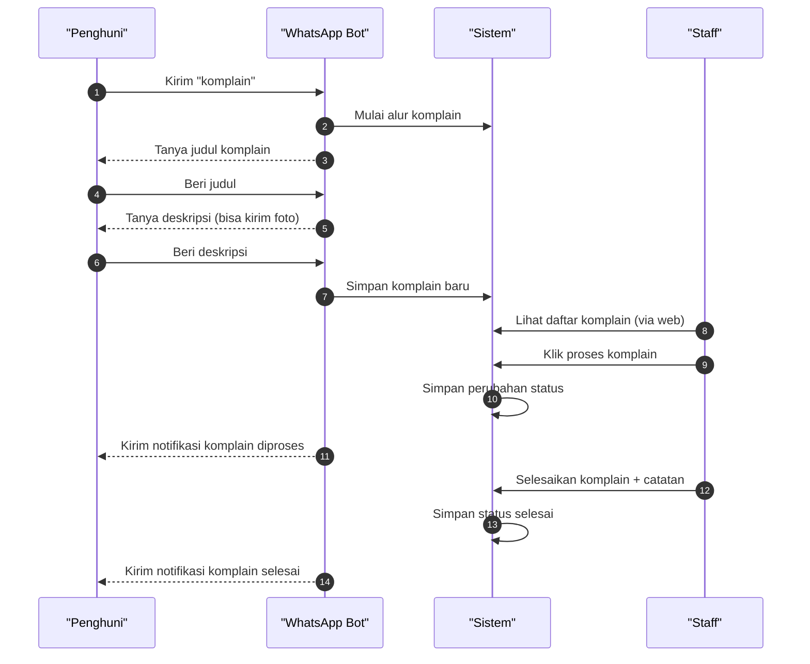

# Komplain

```mermaid
sequenceDiagram
    autonumber
    participant Penghuni as "Penghuni"
    participant WhatsAppBot as "WhatsApp Bot"
    participant Sistem as "Sistem"
    participant Staff as "Staff"

    Penghuni->>WhatsAppBot: Kirim "komplain"
    WhatsAppBot->>Sistem: Mulai alur komplain
    WhatsAppBot-->>Penghuni: Tanya judul komplain
    Penghuni->>WhatsAppBot: Beri judul
    WhatsAppBot-->>Penghuni: Tanya deskripsi (bisa kirim foto)
    Penghuni->>WhatsAppBot: Beri deskripsi
    WhatsAppBot->>Sistem: Simpan komplain baru
    Staff->>Sistem: Lihat daftar komplain (via web)
    Staff->>Sistem: Klik proses komplain
    Sistem->>Sistem: Simpan perubahan status
    WhatsAppBot-->>Penghuni: Kirim notifikasi komplain diproses
    Staff->>Sistem: Selesaikan komplain + catatan
    Sistem->>Sistem: Simpan status selesai
    WhatsAppBot-->>Penghuni: Kirim notifikasi komplain selesai
```
