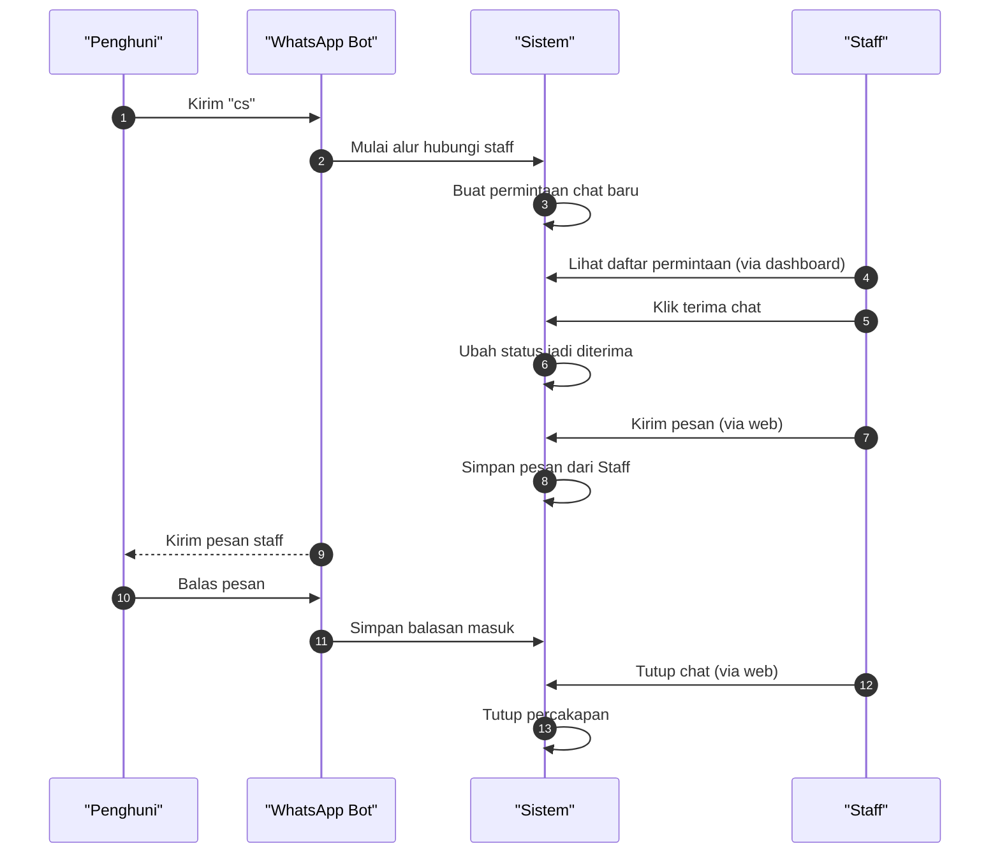

# Hubungi Staff

```mermaid
sequenceDiagram
    autonumber
    participant Penghuni as "Penghuni"
    participant WhatsAppBot as "WhatsApp Bot"
    participant Sistem as "Sistem"
    participant Staff as "Staff"

    Penghuni->>WhatsAppBot: Kirim "cs"
    WhatsAppBot->>Sistem: Mulai alur hubungi staff
    Sistem->>Sistem: Buat permintaan chat baru
    Staff->>Sistem: Lihat daftar permintaan (via dashboard)
    Staff->>Sistem: Klik terima chat
    Sistem->>Sistem: Ubah status jadi diterima
    Staff->>Sistem: Kirim pesan (via web)
    Sistem->>Sistem: Simpan pesan dari Staff
    WhatsAppBot-->>Penghuni: Kirim pesan staff
    Penghuni->>WhatsAppBot: Balas pesan
    WhatsAppBot->>Sistem: Simpan balasan masuk
    Staff->>Sistem: Tutup chat (via web)
    Sistem->>Sistem: Tutup percakapan
```
