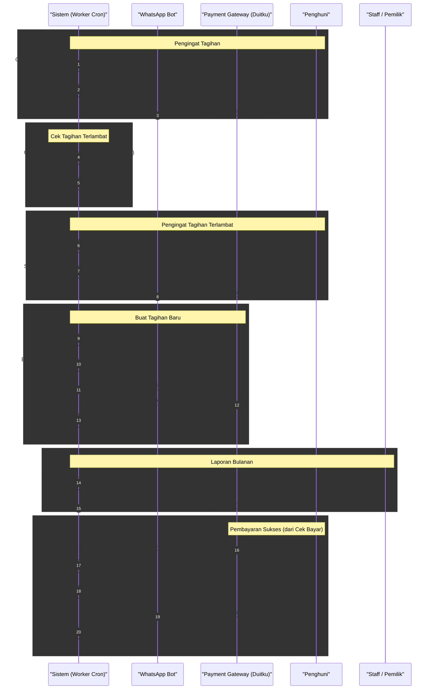

# Notifikasi Otomatis

```mermaid
sequenceDiagram
    autonumber
    participant SistemWorker as "Sistem (Worker Cron)"
    participant WhatsAppBot as "WhatsApp Bot"
    participant PaymentGateway as "Payment Gateway (Duitku)"
    participant Penghuni as "Penghuni"
    participant StaffOwner as "Staff / Pemilik"

    rect
        Note over SistemWorker,Penghuni: Pengingat Tagihan
        SistemWorker->>SistemWorker: Cari tagihan belum bayar (jatuh tempo dalam 3 hari)
        SistemWorker->>SistemWorker: Siapkan pengingat bayar
        WhatsAppBot-->>Penghuni: Kirim pengingat tagihan via WhatsApp
    end

    rect
        Note over SistemWorker: Cek Tagihan Terlambat
        SistemWorker->>SistemWorker: Cari tagihan belum bayar (lewat jatuh tempo)
        SistemWorker->>SistemWorker: Tandai tagihan lewat jatuh tempo
    end

    rect
        Note over SistemWorker,Penghuni: Pengingat Tagihan Terlambat
        SistemWorker->>SistemWorker: Cari tagihan status terlambat
        SistemWorker->>SistemWorker: Siapkan pengingat tagihan lewat jatuh tempo
        WhatsAppBot-->>Penghuni: Kirim pengingat tagihan terlambat
    end

    rect
        Note over SistemWorker,PaymentGateway: Buat Tagihan Baru
        SistemWorker->>SistemWorker: Cari kontrak aktif
        SistemWorker->>SistemWorker: Buat tagihan baru (7 hari sebelum jatuh tempo)
        SistemWorker->>PaymentGateway: Minta link pembayaran Duitku
        PaymentGateway-->>SistemWorker: Kirim link pembayaran
        SistemWorker->>SistemWorker: Simpan link di tagihan
    end

    rect
        Note over SistemWorker,StaffOwner: Laporan Bulanan
        SistemWorker->>SistemWorker: Hitung total tagihan bulan lalu
        SistemWorker-->>StaffOwner: Kirim laporan (jumlah lunas vs belum bayar)
    end

    rect
        Note over PaymentGateway,Penghuni: Pembayaran Sukses (dari Cek Bayar)
        PaymentGateway-->>SistemWorker: Kirim notifikasi bayar sukses
        SistemWorker->>SistemWorker: Ubah status tagihan jadi lunas
        SistemWorker->>SistemWorker: Siapkan notifikasi bayar sukses
        WhatsAppBot-->>Penghuni: Kirim konfirmasi bayar sukses
        SistemWorker->>SistemWorker: Verifikasi penghuni jika bayar pertama
    end
```
